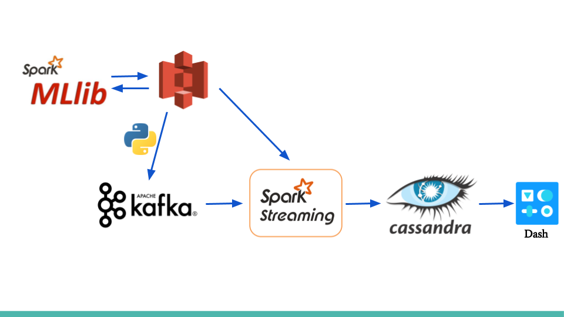

# Server Safe
My Insight Data Engineering project for the NY Winter 2019 session. "Server Safe" is an application that uses a data pipeline to monitor web server traffic and predict potential attacks in real time.

A website of the application can be found [here](http://nysees.xyz)

# Motivation
In the online world, it is important to monitor server health and traffic to be alert of potential attacks from other users. The most famous attack is the DoS (Denial of Service) attack where a single IP or multiple IPs flush the web server with requests thereby paralyzing the service. Other harmful activities include SQL injection or bots. Therefore, it is necessary to have an automated an accurate system to monitor live traffic through web servers and alert engineers or admins of the potential risks

# Pipeline

"Server Safe" runs a pipeline on the AWS cloud, using the following cluster configurations:

* four m4.large EC2 instances for Kafka
* four m4.large EC2 instances for the Spark Streaming job
* One m4.large EC2 instances for the Spark batch job
* Two m4.large EC2 instances to run Cassandra DB and the Dash front-end application

Using Kafka to ingest traffic stream simulated from a file on S3, Spark Streaming to predicted potential attacks in 5 second intervals using a pre-trained model by Spark batch job and Cassandra to store the processed data to be queried, the data is then rendered in Dash to show real-time updates to server traffic or attack predictions every second.

